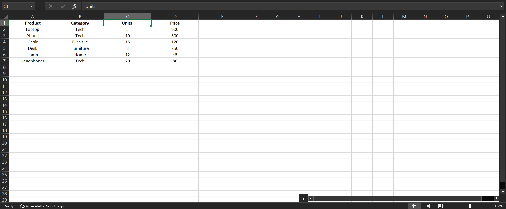
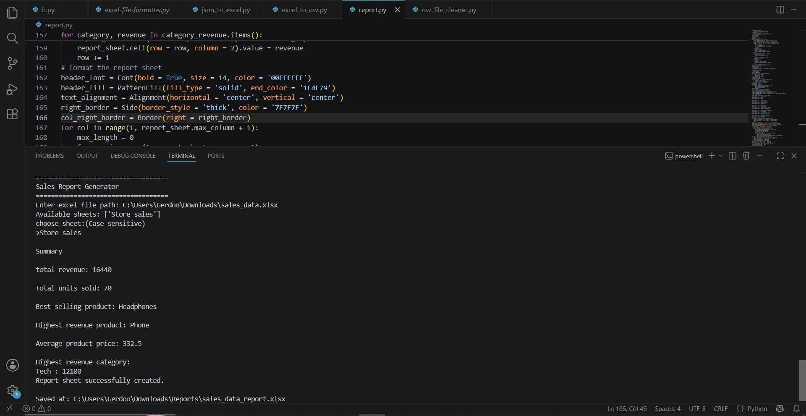
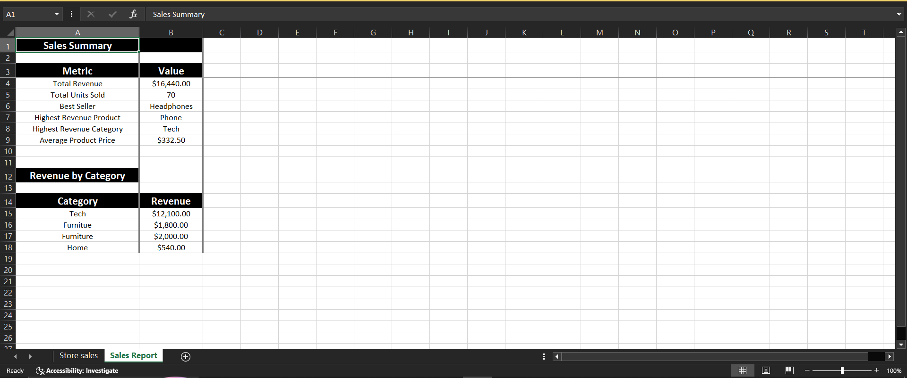

# 📊 Sales Report Generator


A Python automation tool that transforms raw Excel sales data into a structured sales analysis report.

The program reads sales spreadsheets, validates required columns, calculates key business metrics, analyzes revenue performance, and generates a formatted Excel report automatically.

---

# 🖥️ Demo

### Sales Data ➜ Automated Analysis ➜ Generated Report

<p align="center">
  
  
</p>

<p align="center">
  
</p>

---

# 🎯 Problem

Sales reports often require repetitive manual work:

- Calculating total revenue
- Finding top-performing products
- Comparing category performance
- Preparing formatted summaries


Performing these tasks manually can be time-consuming and prone to errors.

---

# ✅ Solution

This tool automates Excel sales analysis by:

- Reading sales data directly from Excel workbooks
- Validating required columns before processing
- Calculating important sales metrics
- Generating a dedicated report worksheet
- Applying professional formatting automatically

The original workbook is preserved, and the generated report is saved as a new Excel file.

---

# ⚡ Core Features

- 📂 **Excel Workbook Processing**  
  Loads existing Excel files and allows users to select the worksheet they want to analyze.

- 🔎 **Automatic Column Detection**  
  Identifies required fields such as Product, Category, Price, and Units.

- ✅ **Data Validation**  
  Checks for missing columns and invalid sales data before generating the report.

- 💰 **Revenue Analysis**  
  Calculates total revenue based on product prices and units sold.

- 📦 **Product Performance Analysis**  
  Identifies:
  - Best-selling product by units sold
  - Highest revenue product

- 🗂️ **Category Revenue Analysis**  
  Calculates revenue contribution by category and identifies the highest-performing category.

- 📊 **Automated Report Generation**  
  Creates a dedicated "Sales Report" worksheet containing:
  - Total revenue
  - Total units sold
  - Best-selling product
  - Highest revenue product
  - Highest revenue category
  - Average product price
  - Revenue breakdown by category

- 🎨 **Report Formatting**  
  Applies headers, alignment, borders, column sizing, and currency formatting for improved readability.

---

# 🛠️ Tech Stack

- **Language:** Python 3.x
- **Spreadsheet Processing:** `openpyxl`
- **File Handling:** `pathlib`
- **System Utilities:** `sys`

---

# 🚀 Quick Start

## 1. Clone the repository

```bash
git clone https://github.com/DevBlueprintLab/sales-report-generator.git

cd sales-report-generator
```

## 2. Install dependencies

```bash
pip install -r requirements.txt
```

## 3. Run the generator

```bash
python main.py
```

## 4. Select your Excel file and worksheet

Example:

```text
===================================
Sales Report Generator
===================================

Enter excel file path:
sample_data/sales_data.xlsx

Available sheets:
['Sales']

choose sheet:
>Sales
```

## 5. Generated output

The report will automatically be saved inside:

```text
Reports/
```

Example:

```text
Reports/
└── sales_data_report.xlsx
```

---

# 📁 Project Structure

```text
sales-report-generator/

├── main.py       # Main automation script
├── README.md                       # Project documentation
├── requirements.txt                # Project dependencies
├── sample_data/
│   └── sales_data.xlsx             # Example sales dataset
└── images/
    ├── sales-input.png             # Original sales spreadsheet
    ├── analysis-process.png        # Terminal analysis process
    └── generated-report.png        # Generated Excel report
```

---

# 🔄 Workflow

```
Excel Sales File
        |
        ↓
Load Workbook
        |
        ↓
Select Worksheet
        |
        ↓
Validate Required Columns
        |
        ↓
Calculate Sales Metrics
        |
        ↓
Generate Report Worksheet
        |
        ↓
Format & Save Excel Report
```

---

# 💼 Practical Use Cases

Useful for:

- Small business sales reporting
- Retail performance analysis
- Monthly sales summaries
- Automated Excel reporting workflows
- Reducing repetitive spreadsheet calculations

---

# 🔮 Future Improvements

- Add charts and visual dashboards
- Support CSV input files
- Add date-based sales analysis
- Export reports to PDF
- Add automated email delivery

---

# 📜 License

This project is licensed under the MIT License.

---

Developed by **DevBlueprintLab**
